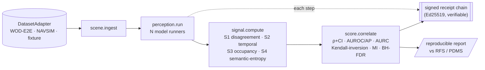

# PerceptionProof

**Can a cheap, label-free signal predict the long-tail driving failures that today only expensive human raters catch — and recover the safety ranking where the field's own open-loop metrics fail?**

PerceptionProof is a reproducible study and harness that tests exactly that question, with full tamper-evident provenance. It does not drive a car, replace a perception model, or claim at-scale safety evidence. It attacks the one problem autonomous-driving research openly confesses is unsolved: **evaluation that predicts safety.**

---

## The premise (verified, not marketing)

- A 2026 cross-benchmark study found open-loop planning metrics *mis-rank* closed-loop driving safety, with "clear ranking inversions" — the scoreboard does not predict safety (arXiv 2605.00066).
- The current substitute is human raters: Waymo's Rater Feedback Score on long-tail segments (WOD-E2E, arXiv 2510.26125).
- We test whether label-free signals — model disagreement, temporal inconsistency, occupancy conflict, VLA reasoning self-consistency — recover the human-judged ranking cheaply.

Full grounding and verification grades: `docs/MATHEMATICS.md`.

## What is and isn't novel (stated honestly)

- **Not novel:** disagreement-as-uncertainty (Deep Ensembles, 2017). We do not claim it.
- **The contribution:** (1) bridging cheap label-free signals to the 2026 metric-validity crisis on the long tail; (2) a falsifiable, multi-signal study under one rigorous protocol; (3) auditable, signed provenance for the whole evaluation. Publishable even if the result is negative.

## Results to date

Measured on **real** NAVSIM scenes (OpenScene/nuPlan), scored by the unit-tested statistics in this repo. Each result links to its reproduction and its caveats.

| Test | Outcome | Result | Status |
|---|---|---|---|
| Disagreement vs open-loop error | ADE vs human future | Spearman ρ = **0.699** [0.599, 0.750], AUROC 0.855 | done — [report](results/navsim_p2a_report.md) |
| Independent outcome (leave-one-out) | error of a *held-out* model | ρ = **0.683** [0.589, 0.729] | done — retires the coupling caveat |
| Disagreement vs closed-loop PDMS **score** | PDM simulator score | ρ = **−0.074** [−0.396, 0.285] — no transfer | done — [report](results/navsim_p2b_report.md) |
| Label-free signals vs PDMS **gate events** | binary NC (collision) / DAC (off-road) | **AUROC 0.77–0.83** (CIs exclude chance, 55 drives); collision-geometry vs disagreement inconclusive | done — [report](results/navsim_p2c_report.md) |
| Label-free signals vs **human** RFS (WOD-E2E) | rater feedback | — | planned |

Honest reading — the arc resolves cleanly: a label-free signal predicts **open-loop** error (P2a, ρ = 0.70), does **not** transfer to the closed-loop PDMS **score** (P2b, ρ ≈ 0 — reproducing the open-loop↔closed-loop gap), **but does** predict the closed-loop **failure events** — the binary collision/off-road gates — at AUROC ~0.8 (P2c), once the target is reframed from the smooth score to the gates the score is built on. A second, honest null: no single signal (collision-geometry vs disagreement) decisively wins on its matched gate — the *reframing* matters more than the *signal*. Caveats (weak ego-status planner; single split): see the P2c report.

## Pre-registered hypotheses

| | Claim | Confirmed if |
|---|---|---|
| H1 | A label-free signal predicts per-segment RFS | Spearman ρ ≥ 0.3, BH-corrected q < 0.05 |
| H2 | A signal-adjusted ranking beats the open-loop metric | Kendall-distance to ground truth strictly lower (bootstrap CI > 0) |
| H3 | The signal triages failures better than chance | AP > base rate and E-AURC < random |

A null on all three is a real, reported finding. The integrity is the product. See `PREREGISTRATION.md` (frozen before results).

## How it works



The science (signals, metrics, statistics) is open and backend-agnostic. The same pipeline
runs over a deterministic local backend (zero external deps, full reproducibility) or a
governed production backend (signed receipts) by swapping the `DatasetAdapter` and model
runners — nothing downstream changes. See `docs/ARCHITECTURE.md`.

## Reproduce

The synthetic end-to-end run (no data, no GPU) exercises the whole machine and verifies the receipt chain:

```bash
pip install -e ".[dev]"
pytest                                                     # signals, statistics, receipts
python -m harness.cli run --backend synthetic              # full mission -> results/ + receipts
python -m harness.cli verify results/synthetic_receipts.jsonl   # -> VERIFIED
```

The real NAVSIM result is reproduced under [`experiments/navsim_p2a/`](experiments/navsim_p2a/) (setup, data, train, analyze).

## Status

Signals (S1–S4), validity statistics, and the tamper-evident receipt chain are implemented and unit-tested. The pipeline has produced a real open-loop result on NAVSIM; the closed-loop (PDMS) and human-rated (RFS) tests are the active work. Build cadence is deliberate — no phase advances until its gate is objectively met, and negative results are published. See `docs/CONTINUITY.md`.

## Data & licensing

Code: Apache-2.0 (`LICENSE`). Datasets (WOD-E2E, NAVSIM/nuPlan) are non-commercial research licenses — this repo redistributes **no** frames, only segment ids and our derived outputs/receipts. See `DATA_LICENSES.md`.

## Layout

```
docs/MATHEMATICS.md     every signal and validity metric, formalized
docs/ARCHITECTURE.md    backend interface, receipts, mission DAG
docs/CONTINUITY.md      status, outcomes, and exact resume point
PREREGISTRATION.md      frozen hypotheses, thresholds, slice, seed
perceptionproof/        signals (S1–S4), statistics, receipts, backends
harness/                runner + CLI + receipt verifier
experiments/            real-data experiments (NAVSIM) + reproduction
results/                reports and signed receipts
protocol/               pinned models and slice ids
```
