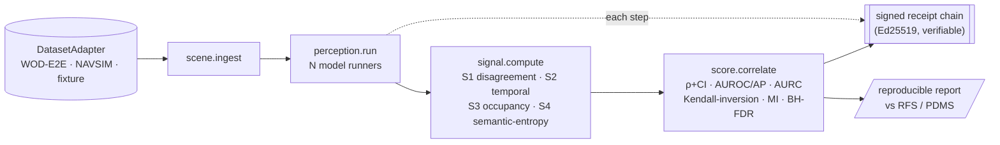

# PerceptionProof

**Can a cheap, label-free signal predict the long-tail driving failures that today only expensive human raters catch — and recover the safety ranking where the field's own open-loop metrics fail?**

PerceptionProof is a reproducible study and harness that tests exactly that question, with full tamper-evident provenance. It does not drive a car, replace a perception model, or claim at-scale safety evidence. It attacks the one problem autonomous-driving research openly confesses is unsolved: **evaluation that predicts safety.**

---

## The premise (verified, not marketing)

- A 2026 cross-benchmark study found open-loop planning metrics *mis-rank* closed-loop driving safety, with "clear ranking inversions" — the scoreboard does not predict safety (arXiv 2605.00066).
- The current substitute is human raters: Waymo's Rater Feedback Score on long-tail segments (WOD-E2E, arXiv 2510.26125).
- We test whether label-free signals — model disagreement, temporal inconsistency, occupancy conflict, VLA reasoning self-consistency — recover the human-judged ranking cheaply.

Full grounding and verification grades: see the companion thesis (Aweb internal) and `docs/MATHEMATICS.md`.

## What is and isn't novel (stated honestly)

- **Not novel:** disagreement-as-uncertainty (Deep Ensembles, 2017). We do not claim it.
- **The contribution:** (1) bridging cheap label-free signals to the 2026 metric-validity crisis on the long tail; (2) a falsifiable, multi-signal study under one rigorous protocol; (3) auditable, signed provenance for the whole evaluation. Publishable even if the result is negative.

## Pre-registered hypotheses

| | Claim | Confirmed if |
|---|---|---|
| H1 | A label-free signal predicts per-segment RFS | Spearman ρ ≥ 0.3, BH-corrected q < 0.05 |
| H2 | A signal-adjusted ranking beats the open-loop metric | Kendall-distance to ground truth strictly lower (bootstrap CI > 0) |
| H3 | The signal triages failures better than chance | AP > base rate and E-AURC < random |

A null on all three is a real, reported finding. The integrity is the product. See `PREREGISTRATION.md` (frozen before results).

## How it works



The science (signals, metrics, statistics) is open and backend-agnostic. The same pipeline
runs over a deterministic local backend (zero external deps, full reproducibility) or a
governed production backend (signed receipts) by swapping the `DatasetAdapter` and model
runners — nothing downstream changes. See `docs/ARCHITECTURE.md`.

## Reproduce

```bash
# (target interface — implemented across phases P2–P5)
pip install -e .
perceptionproof run --backend local --slice protocol/slices.json --out results/
perceptionproof verify results/receipts/   # checks hash chain + signatures
```

## Status

Phase **P1 — scaffold**. Hypotheses frozen, mathematics and architecture specified, capability contracts defined. Datasets and models not yet wired. Build cadence is deliberate: no phase advances until its gate is objectively met. See `docs/CONTINUITY.md`.

## Data & licensing

Code: Apache-2.0 (`LICENSE`). Datasets (WOD-E2E, NAVSIM/nuPlan) are non-commercial research licenses — this repo redistributes **no** frames, only segment ids and our derived outputs/receipts. See `DATA_LICENSES.md`.

## Layout

```
docs/MATHEMATICS.md     every signal and validity metric, formalized
docs/ARCHITECTURE.md    Maestro-native, receipt-backed system design
docs/CONTINUITY.md      process, outcomes, and exact resume point for future sessions
PREREGISTRATION.md      frozen hypotheses, thresholds, slice, seed
protocol/               pinned models (hashed) and segment ids
signals/                S1–S4 reference implementations
harness/                the runner + receipt verifier
results/                reproducible reports + signed receipts
```
