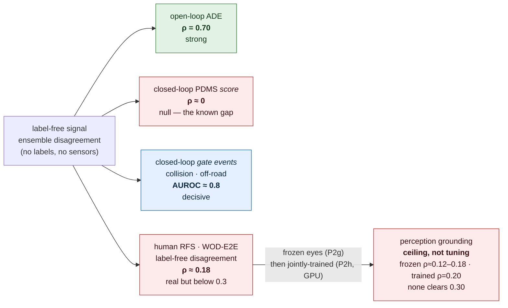
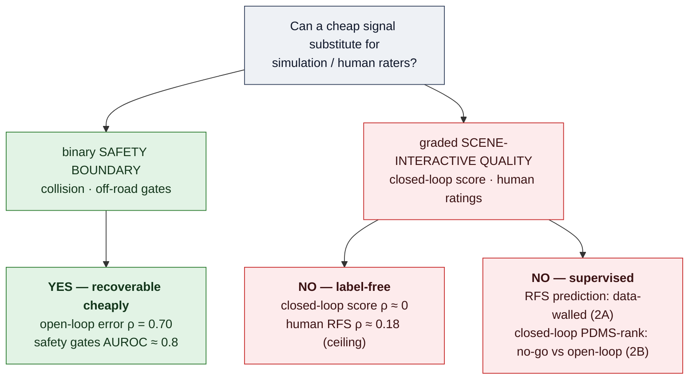
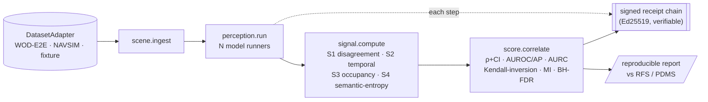

# PerceptionProof

**Can a cheap, label-free signal predict the long-tail driving failures that today only expensive human raters catch — and recover the safety ranking where the field's own open-loop metrics fail?**

PerceptionProof is a reproducible study and harness that tests exactly that question, with full tamper-evident provenance. It does not drive a car, replace a perception model, or claim at-scale safety evidence. It attacks the one problem autonomous-driving research openly confesses is unsolved: **evaluation that predicts safety.**

**The full write-up is the paper: [`docs/PAPER.md`](docs/PAPER.md)** — one label-free signal traced across four targets (open-loop error → closed-loop score → safety gates → human ratings), with pre-registered nulls and an in-line self-correction.

**Phase 2 is underway and pre-registered: [`docs/PHASE2_PROGRAM.md`](docs/PHASE2_PROGRAM.md)** — Phase 1 found label-free signals hit a *ceiling* against human ratings (ρ≈0.18); Phase 2 builds the first **supervised** model of human driving preference (a learned Rater-Feedback-Score predictor / reward model) to break it. Gates frozen before results. **Phase 2 verdict ([2A](docs/PHASE2A_FINDINGS.md) · [2B](docs/PHASE2B_FINDINGS.md)): two pre-registered nulls, triangulating one thesis.** Supervised human-RFS prediction is *data-walled* (2A: the only abundant supervision *is* the displacement signal); and a cheap learned predictor of *closed-loop PDMS* does not beat the open-loop metric at recovering the ranking (2B: closed-loop quality is scene-interactive, invisible to cheap scene-light signals). Unifying result across the whole study: **cheap evaluation recovers the binary safety boundary (gates, AUROC ~0.8) but cannot substitute for simulation or human raters on graded, scene-interactive quality** — which is exactly why the field needs them. Reported, not buried.

---

## The premise (verified, not marketing)

- A 2026 cross-benchmark study found open-loop planning metrics *mis-rank* closed-loop driving safety, with "clear ranking inversions" — the scoreboard does not predict safety (arXiv 2605.00066).
- The current substitute is human raters: Waymo's Rater Feedback Score on long-tail segments (WOD-E2E, arXiv 2510.26125).
- We test whether label-free signals — model disagreement, temporal inconsistency, occupancy conflict, VLA reasoning self-consistency — recover the human-judged ranking cheaply.

Full grounding and verification grades: `docs/MATHEMATICS.md`.

## What is and isn't novel (stated honestly)

- **Not novel:** disagreement-as-uncertainty (Deep Ensembles, 2017). We do not claim it.
- **The contribution:** (1) bridging cheap label-free signals to the 2026 metric-validity crisis on the long tail; (2) a falsifiable, multi-signal study under one rigorous protocol; (3) auditable, signed provenance for the whole evaluation. Publishable even if the result is negative.

## Results to date

Measured on **real** NAVSIM scenes (OpenScene/nuPlan), scored by the unit-tested statistics in this repo. Each result links to its reproduction and its caveats.

| Test | Outcome | Result | Status |
|---|---|---|---|
| Disagreement vs open-loop error | ADE vs human future | Spearman ρ = **0.699** [0.599, 0.750], AUROC 0.855 | done — [report](results/navsim_p2a_report.md) |
| Independent outcome (leave-one-out) | error of a *held-out* model | ρ = **0.683** [0.589, 0.729] | done — retires the coupling caveat |
| Disagreement vs closed-loop PDMS **score** | PDM simulator score | ρ = **−0.074** [−0.396, 0.285] — no transfer | done — [report](results/navsim_p2b_report.md) |
| Label-free signals vs PDMS **gate events** | binary NC (collision) / DAC (off-road) | **AUROC 0.77–0.83** (CIs exclude chance, 55 drives); collision-geometry vs disagreement inconclusive | done — [report](results/navsim_p2c_report.md) |
| Label-free signals vs **TransFuser** gates (real sensor planner) | NC / DAC / any-gate | pipeline validated (396 scenes, 52 drives, 0 err); **underpowered/inconclusive** — a strong planner rarely fails (3 collisions, 12 off-road) | done — [report](results/navsim_p2d_transfuser_report.md) |
| Label-free signal vs **human** RFS (WOD-E2E) | Waymo Rater Feedback Score | ρ ≈ **+0.18** (mean over 20 seed-sets; ego-status), real but **below the 0.3 bar — H1 not met**; oracle ADE anchor ρ = 0.40 | done — [report](results/wod_e2e_rfs_report.md) |
| **Perception grounding** (frozen DINOv2, front + 8-cam) vs human RFS | does scene perception help? | **No robust effect** — 20-seed-set stability study: P(vision>ego) ≈ 0.10–0.30, paired Δ intervals straddle 0. (A preliminary single draw suggested a lift; it did not replicate.) | done — [report](results/wod_e2e_rfs_surround_report.md) |
| **Jointly-trained vision ensemble** (GPU, end-to-end) vs human RFS | does a driving-trained planner help? | ρ = **+0.202** [0.123, 0.280] — tighter signal + better planner (ADE-vs-RFS 0.46), but **still under 0.30, overlaps ego.** H1 not met even here | done — [report](results/wod_e2e_rfs_jointtrained_report.md) |

Honest reading — the arc resolves cleanly: a label-free signal predicts **open-loop** error (P2a, ρ = 0.70), does **not** transfer to the closed-loop PDMS **score** (P2b, ρ ≈ 0 — reproducing the open-loop↔closed-loop gap), **but does** predict the closed-loop **failure events** — the binary collision/off-road gates — at AUROC ~0.8 (P2c), once the target is reframed from the smooth score to the gates the score is built on. A second, honest null: no single signal (collision-geometry vs disagreement) decisively wins on its matched gate — the *reframing* matters more than the *signal*. Against the actual **human raters** (WOD-E2E RFS, P2e) the same cheap signal is **real but weak** — ρ = 0.15 (CI excludes 0, BH q < 0.05) yet **below the pre-registered 0.3 bar, so H1 is not met**; an oracle anchor (ADE, which needs the human label) reaches ρ = 0.40, so RFS *is* predictable — the ego-status-only ensemble simply carries too little scene information. We tested whether giving the ensemble *eyes* helps: a frozen DINOv2 image embedding (front camera, then the full 8-camera surround) added to the input. A single instantiation suggested a lift (P2f) — but a **20-seed-set stability study (P2g)** shows that lift was **seed-noise**: the rungs overlap (mean ρ ego 0.18, front 0.16, surround 0.12), every paired interval straddles zero, and the point estimates favor *ego*. So **frozen-encoder perception grounding does not robustly improve the signal** — a published null we caught by reporting distributions instead of a single draw, and corrected our own preliminary claim over. **P2h then settled the one thing P2g could not rule out:** a **jointly-trained** end-to-end vision ensemble (DINOv2 fine-tuned on driving, on a GPU). It landed at ρ = 0.202 [0.123, 0.280] — a *tighter* signal and a *better* planner (ADE-vs-RFS 0.46, the highest in the project), yet the disagreement-vs-RFS correlation **still does not reach 0.30 and overlaps the blind ego baseline.** Across ego-only, frozen-image, surround, and jointly-trained vision the signal sits at ρ ≈ 0.12–0.20 — a genuine **ceiling**, not a tuning problem: ensemble disagreement is a strong proxy for open-loop error and binary safety events, but only a weak proxy for the fine-grained quality human raters score. Caveats and the full arc: see the P2e / P2f / P2g / P2h reports.

The same label-free signal, carried across four targets of increasing realism — strong on
the cheap proxy, null on the smooth closed-loop score, decisive on the binary safety gates,
weak against human judgment with an ego-only planner:



The intellectual payload is this shape, not any single number: cheap signals track the
cheap metric, fail the metric the field already knows is broken, recover the *safety
events* — exactly where an evaluation layer needs to work — and, against human judgment,
stay weak (ρ ≈ 0.18), with frozen-encoder perception grounding giving **no robust lift**
once you average over seeds instead of trusting one draw.

### The complete picture (Phase 1 + Phase 2)

Phase 2 then attacked the human-rating gap with *supervision* (not just label-free signals) and
hit a second wall. Triangulated across four targets and both regimes, the whole study lands on one
clean, two-sided thesis:



Cheap evaluation recovers the **binary safety boundary** an evaluation layer most needs, and —
by ceiling (label-free) and by data wall + no-go (supervised) — provably does **not** substitute
for simulation or human raters on **graded, scene-interactive quality**. A characterization, not a
leaderboard win, with a mechanism for each side. Full write-up: [`docs/PAPER.md`](docs/PAPER.md).

## Pre-registered hypotheses

| | Claim | Confirmed if |
|---|---|---|
| H1 | A label-free signal predicts per-segment RFS | Spearman ρ ≥ 0.3, BH-corrected q < 0.05 |
| H2 | A signal-adjusted ranking beats the open-loop metric | Kendall-distance to ground truth strictly lower (bootstrap CI > 0) |
| H3 | The signal triages failures better than chance | AP > base rate and E-AURC < random |

A null on all three is a real, reported finding. The integrity is the product. See `PREREGISTRATION.md` (frozen before results).

## How it works



The science (signals, metrics, statistics) is open and backend-agnostic. The same pipeline
runs over a deterministic local backend (zero external deps, full reproducibility) or a
governed production backend (signed receipts) by swapping the `DatasetAdapter` and model
runners — nothing downstream changes. See `docs/ARCHITECTURE.md`.

## Reproduce

The synthetic end-to-end run (no data, no GPU) exercises the whole machine and verifies the receipt chain:

```bash
pip install -e ".[dev]"
pytest                                                     # signals, statistics, receipts
python -m harness.cli run --backend synthetic              # full mission -> results/ + receipts
python -m harness.cli verify results/synthetic_receipts.jsonl   # -> VERIFIED
```

**Every headline number regenerates from committed derived data** — no dataset download, no GPU. The scored per-scene outputs (segment ids + trajectories + gate flags + RFS — no frames) are committed next to each analysis, and the unit-tested statistics recompute the reported figures:

```bash
# NAVSIM arc (P2a open-loop, P2b closed score, P2c safety gates, P2d real-sensor)
python experiments/navsim_p2a/analyze.py        experiments/navsim_p2a/pp_result.json        # rho=0.699, AUROC 0.855
python experiments/navsim_p2a/leave_one_out.py  experiments/navsim_p2a/pp_result.json        # rho=0.683 (independent outcome)
python experiments/navsim_p2b/analyze_pdms.py   experiments/navsim_p2b/pp_pdms.json          # rho=-0.074 (null)
python experiments/navsim_p2c/analyze.py        experiments/navsim_p2c/pp_p2c_scaled.json    # NC/DAC gates AUROC 0.77-0.83
python experiments/navsim_p2c/leave_one_out_nc.py experiments/navsim_p2c/pp_p2c_scaled.json  # NC AUROC 0.821
python experiments/navsim_p2c/analyze.py        experiments/navsim_p2c/tf_mini_result.json   # P2d TransFuser (underpowered)

# WOD-E2E human-rating arc (P2e-P2h)
python experiments/wod_e2e_rfs/analyze.py          experiments/wod_e2e_rfs/wod_rfs_out.json          # ego-only RFS
python experiments/wod_e2e_rfs/analyze_surround.py                                                    # P2g stability (corrects P2f)
python experiments/wod_e2e_rfs/analyze_p2h.py                                                         # jointly-trained vision
```

Full data-acquisition + scoring pipelines (dataset-bound) are under each `experiments/<name>/` (setup, data, train, score). The committed derived outputs let any reviewer verify the figures offline, against the unit-tested statistics in this repo, with the dataset never leaving its license.

## Status

Signals (S1–S4), validity statistics, and the tamper-evident receipt chain are implemented and unit-tested. On real NAVSIM scenes the pipeline has produced the full arc above (P2a–P2c): open-loop predictable, closed-loop *score* not, closed-loop *gate events* yes. The real-sensor extension — TransFuser, a 3-seed SOTA camera+LiDAR planner — now **runs end-to-end** (396 scenes, 52 drives, 0 errors) on the frame-consistent `mini` split; on `mini` the signal-vs-gate result is **underpowered/inconclusive** because a strong planner rarely fails (only 3 collisions / 12 off-road), so a powered real-sensor measurement needs a larger consistent dataset ([report](results/navsim_p2d_transfuser_report.md)). The larger navtrain sensors are a separate frame-version mismatch (documented in `docs/CONTINUITY.md`). The human-rated test is now done: on **479 rater-labeled WOD-E2E frames** the cheap label-free signal predicts Waymo's Rater Feedback Score at ρ ≈ 0.18 (mean over 20 seed-sets) — statistically real but below the pre-registered 0.3 bar, so **H1 is reported as not met** ([report](results/wod_e2e_rfs_report.md)). Neither frozen-encoder perception grounding (front + 8-camera DINOv2, [report](results/wod_e2e_rfs_surround_report.md)) nor a **jointly-trained end-to-end vision ensemble** on a GPU (ρ = 0.202 [0.123, 0.280], [report](results/wod_e2e_rfs_jointtrained_report.md)) lifts the human-RFS correlation past 0.30 — it is a genuine ceiling. Build cadence is deliberate — no phase advances until its gate is objectively met, **negative results and self-corrections are published**.

## Data & licensing

Code: Apache-2.0 (`LICENSE`). Datasets (WOD-E2E, NAVSIM/nuPlan) are non-commercial research licenses — this repo redistributes **no** frames, only segment ids and our derived outputs/receipts. See `DATA_LICENSES.md`.

## Layout

```
docs/MATHEMATICS.md     every signal and validity metric, formalized
docs/ARCHITECTURE.md    backend interface, receipts, mission DAG
docs/CONTINUITY.md      status, outcomes, and exact resume point
PREREGISTRATION.md      frozen hypotheses, thresholds, slice, seed
perceptionproof/        signals (S1–S4), statistics, receipts, backends
harness/                runner + CLI + receipt verifier
experiments/            real-data experiments (NAVSIM) + reproduction
results/                reports and signed receipts
protocol/               pinned models and slice ids
```
