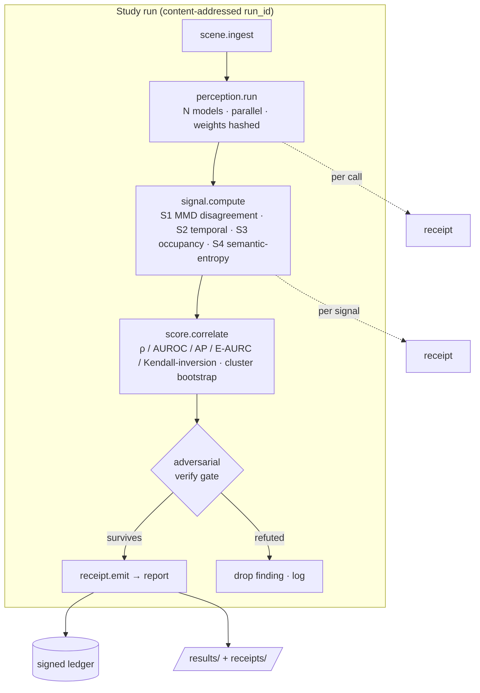
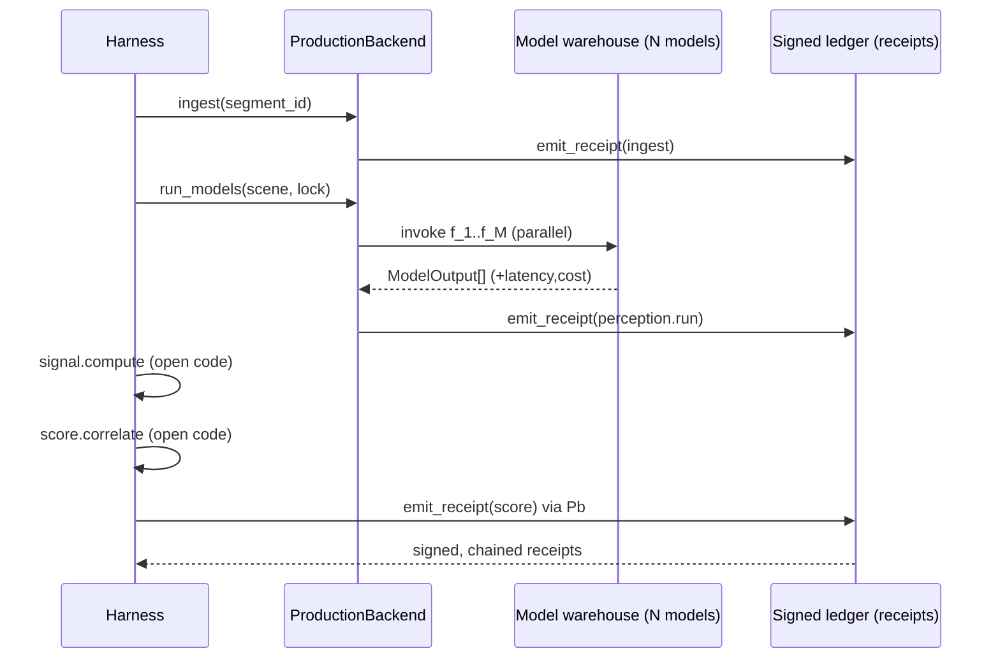

# PerceptionProof — System Architecture

How the study runs as reproducible, receipt-backed work: the science is open and checkable by anyone with no special access, and orchestration is pluggable behind a single backend interface. Every result in this repository is reconstructable with the deterministic local backend alone.

---

## 1. Design principles

1. **Reproducible by a stranger.** Every result is reconstructable from content-addressed inputs and a one-command runner. The repo ships a deterministic local backend, so reproduction needs no external service or credentials.
2. **Backend-independent science.** All signals and statistics consume a typed `ModelOutput` and emit numbers; they do not depend on *how* the models were run. The orchestration layer is swappable without changing a single result.
3. **Tamper-evident provenance.** Every step emits a hash-chained, signed receipt, so the evaluation *process* is auditable after the fact — not just its final outputs.

---

## 2. The backend interface (the keystone)

The harness depends only on this interface. Two implementations exist; both produce identical science.

```python
class PerceptionBackend(Protocol):
    def ingest(self, segment_id: str) -> SceneBundle: ...        # observations + ego/routing + RFS label ref
    def run_models(self, scene: SceneBundle,
                   model_lock: ModelLock) -> list[ModelOutput]:  # N models, parallel, hashed weights
        ...
    def emit_receipt(self, record: StepRecord) -> Receipt: ...   # hash-chain + sign

# LocalBackend  — deterministic, ships in this repo: runs pinned open models or replays cached
#                 ModelOutput fixtures; receipts signed with a repo-local dev key. No external deps.
# A separate governed production backend ("Maestro") implements the same interface for at-scale
# runs (parallel model warehouse, recorded latency/cost, signed receipts). It is NOT required to
# reproduce any result in this repository.
```

`signal.compute`, `score.correlate`, and all statistics (`docs/MATHEMATICS.md`) are backend-agnostic — they consume `ModelOutput` and emit numbers. Only `ingest`, `run_models`, and `emit_receipt` differ across backends. This is what lets an outside reviewer reproduce every figure with `LocalBackend` while at-scale production runs use the governed backend.

---

## 3. Pipeline steps and what each receipt records

Each step is typed and independently receipted:

| Step | Input | Output | Receipt records |
|---|---|---|---|
| `scene.ingest` | `segment_id` | `SceneBundle` | input hash, dataset version, label ref |
| `perception.run` | `SceneBundle`, `ModelLock` | `ModelOutput[]` | per-model weight hash, latency, cost, output hash |
| `signal.compute` | `ModelOutput[]` | `{g1,g2,g3,g4}` | signal code version, values |
| `score.correlate` | signals + target over slice | validity metrics + CIs | protocol hash, bootstrap seed, results hash |
| `receipt.emit` | `StepRecord` | `Receipt` | prev-hash, content-hash, signature |

---

## 4. Study-run DAG



Each node is independently receipted; the verify gate (the same adversarial discipline the research itself was held to) refuses a finding into the report unless it survives refutation.

---

## 5. Receipt schema (tamper-evident provenance)

Canonical JSON, hashed with SHA-256, chained, signed with Ed25519.

```jsonc
{
  "run_id": "blake3(protocol_hash · models_lock_hash · code_version · slice_hash)",
  "step": "perception.run",
  "segment_id": "wod_e2e/seg_000123",
  "inputs_hash": "sha256(canonical(SceneBundle))",
  "outputs_hash": "sha256(canonical(ModelOutput[]))",
  "models": [{ "id": "...", "weights_sha256": "...", "latency_ms": 0, "cost_usd": 0 }],
  "signal_values": { "g1": 0.0, "g2": 0.0, "g3": 0.0, "g4": 0.0 },
  "prev_receipt_hash": "sha256(previous receipt)",
  "content_hash": "sha256(canonical(this minus signature))",
  "signature": "ed25519(content_hash)"
}
```

Verification (open): recompute `content_hash`, check the chain links via `prev_receipt_hash`, and verify the signature against the published key. A stranger can prove the run was not edited after the fact — the audit property that evaluation pipelines usually lack.

---

## 6. Determinism and content addressing

`run_id = blake3(protocol_hash · models_lock_hash · code_version · slice_hash)`. Same inputs → same `run_id` → byte-identical results (fixed bootstrap seed in `PREREGISTRATION.md`). `protocol/models.lock.json` pins model ids + weight hashes; `protocol/slices.json` pins exact segment ids. No frame data is redistributed — only ids and our derived outputs/receipts (see `DATA_LICENSES.md`).

---

## 7. Sequence (one segment, production backend)



The deterministic `LocalBackend` follows the identical sequence with in-process model replay and a repo-local signing key — which is why the entire study reproduces with no external dependency.
