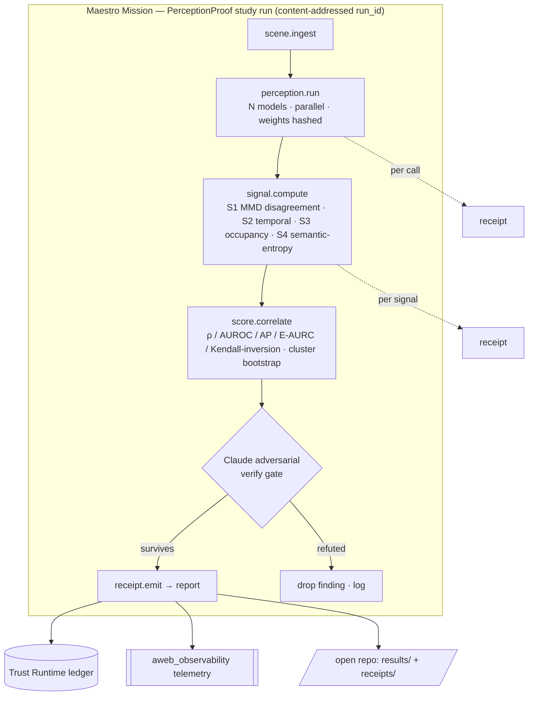
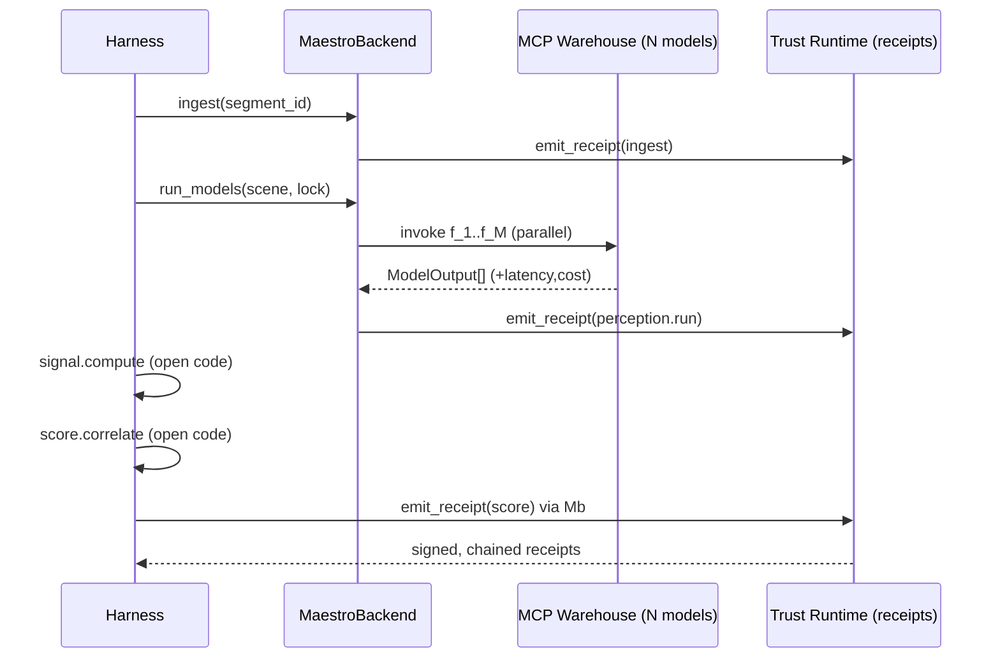

# PerceptionProof — System Architecture

How the study runs as governed, reproducible, receipt-backed work on Aweb's Maestro, while staying fully reproducible by an outside engineer who has no Aweb access. This is the design a top eval-tooling team would ship: the science is open and checkable; the orchestration moat is closed.

---

## 1. Design principles

1. **Reproducible by a stranger.** Every result is reconstructable from content-addressed inputs and a one-command runner. The open repo ships a deterministic local backend so the science needs no Aweb credentials.
2. **Governed orchestration is the moat, not the science.** Aweb's value is the governed multi-model warehouse + tamper-evident receipts, not the perception models (which are public).
3. **Tamper-evident provenance.** Every step emits a hash-chained, signed receipt. The eval process itself is auditable — the gap AV teams have.
4. **Open/closed split via one interface.** A single `PerceptionBackend` interface separates the open harness from the closed Aweb implementation. Swap the backend; the science is identical.

---

## 2. The backend interface (the keystone)

The harness depends only on this interface. Two implementations exist.

```python
class PerceptionBackend(Protocol):
    def ingest(self, segment_id: str) -> SceneBundle: ...        # observations + ego/routing + RFS label ref
    def run_models(self, scene: SceneBundle,
                   model_lock: ModelLock) -> list[ModelOutput]:  # N models, parallel, hashed weights
        ...
    def emit_receipt(self, record: StepRecord) -> Receipt: ...   # hash-chain + sign

# Open repo:   LocalBackend  — deterministic, runs pinned open models or replays cached ModelOutput fixtures;
#                              receipts signed with a repo-local dev key. Zero Aweb dependency.
# Aweb (closed): MaestroBackend — routes run_models through the governed MCP warehouse, records latency/cost,
#                              signs receipts with the Trust-Runtime key, streams telemetry to aweb_observability.
```

`signal.compute`, `score.correlate`, and all statistics (`docs/MATHEMATICS.md`) live in the **open** repo and are backend-agnostic — they consume `ModelOutput` and emit numbers. Only `ingest`, `run_models`, and `emit_receipt` differ across backends. This is what lets an outside reviewer reproduce every figure with `LocalBackend` while production runs on `MaestroBackend`.

---

## 3. Maestro capability surface (Aweb side)

Registered in the governed seven-tool control plane (not flat-registered vendor tools). Each is a typed, planned, receipted capability.

| Capability | Input | Output | Receipt records |
|---|---|---|---|
| `perceptionproof.scene.ingest` | `segment_id` | `SceneBundle` | input hash, dataset version, label ref |
| `perceptionproof.perception.run` | `SceneBundle`, `ModelLock` | `ModelOutput[]` | per-model weight hash, latency, cost, output hash |
| `perceptionproof.signal.compute` | `ModelOutput[]` | `{g1,g2,g3,g4}` | signal code version, values |
| `perceptionproof.score.correlate` | signals + RFS over slice | validity metrics + CIs | protocol hash, bootstrap seed, results hash |
| `perceptionproof.receipt.emit` | `StepRecord` | `Receipt` | prev-hash, content-hash, signature |

A whole study run is a **Maestro mission** whose plan is the DAG below; `aweb_plan` estimates cost/latency before `aweb_execute` runs it.

---

## 4. Mission DAG



Each node is independently receipted; the verify gate (the same 2-of-3 adversarial discipline that the underlying research survived) refuses any finding into the report unless it survives refutation.

---

## 5. Receipt schema (tamper-evident provenance)

Canonical JSON, hashed with SHA-256, chained, signed Ed25519 (reuses Aweb `signing.ts`).

```jsonc
{
  "run_id": "blake3(protocol_hash · models_lock_hash · code_version · slice_hash)",
  "step": "perception.run",
  "segment_id": "wod_e2e/seg_000123",
  "inputs_hash": "sha256(canonical(SceneBundle))",
  "outputs_hash": "sha256(canonical(ModelOutput[]))",
  "models": [{ "id": "...", "weights_sha256": "...", "latency_ms": 0, "cost_usd": 0 }],
  "signal_values": { "g1": 0.0, "g2": 0.0, "g3": 0.0, "g4": 0.0 },
  "prev_receipt_hash": "sha256(previous receipt)",
  "content_hash": "sha256(canonical(this minus signature))",
  "signature": "ed25519(content_hash)"
}
```

Verification (open): recompute `content_hash`, check the chain links via `prev_receipt_hash`, verify the signature against the published key. A stranger can prove the run was not edited after the fact — the audit property AV eval orgs lack today.

---

## 6. Determinism and content addressing

`run_id = blake3(protocol_hash · models_lock_hash · code_version · slice_hash)`. Same inputs → same `run_id` → byte-identical results (fixed bootstrap seed in `PREREGISTRATION.md`). `protocol/models.lock.json` pins model ids + weight hashes; `protocol/slices.json` pins exact segment ids. No frame data is redistributed — only ids and our derived outputs/receipts (see `DATA_LICENSES.md`).

---

## 7. Why this hardens the Maestro loop (the second objective)

This mission is deliberately the kind of workload that stresses Maestro where it matters:

- **Real parallel multi-model fan-out** under the governed warehouse surface (vs toy single calls).
- **Durable long-running missions** with per-step receipts — exercises lease/heartbeat/replay end-to-end.
- **Honest cost/latency telemetry** into `aweb_observability`, surfacing real bottlenecks.
- **An adversarial-verify gate in-loop**, proving Maestro can host a quality gate, not just execute steps.

Failures here are not setbacks; they are observability findings that harden the loop. Building this *is* a Maestro stress test with a publishable artifact as the byproduct.

---

## 8. Sequence (one segment, production backend)


